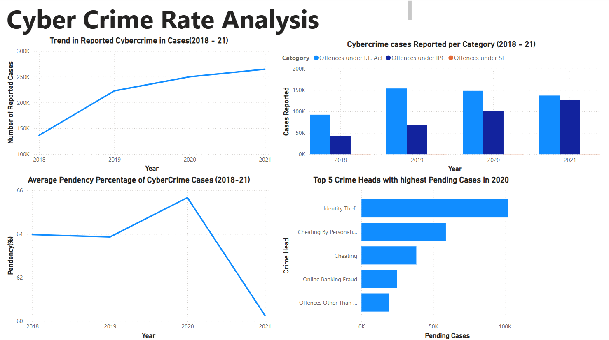
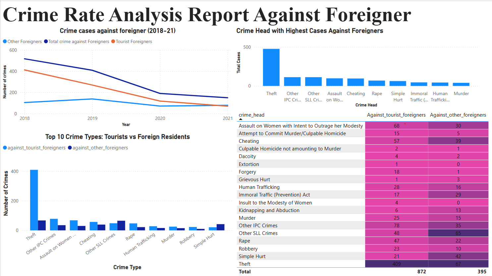
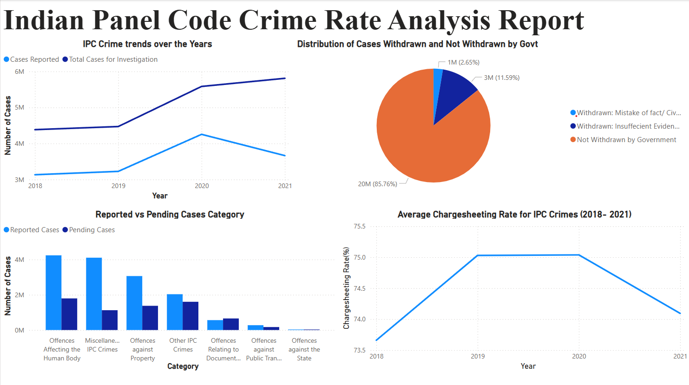
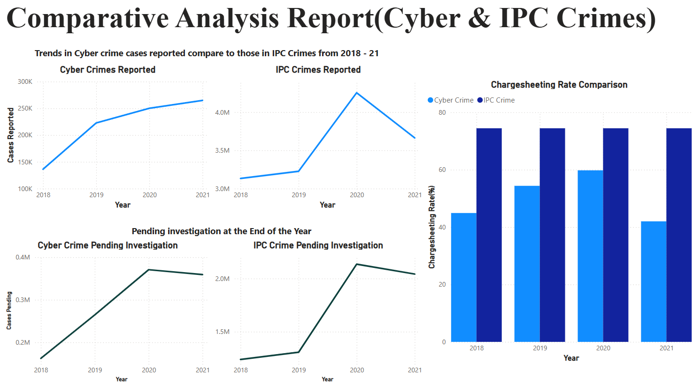

# 🕵️ Crime Rate Analysis using Python & Power BI

## 📌 Overview

This project aims to analyze and visualize crime trends across India using publicly available datasets. The focus is on three key categories:

- **Cyber Crime**
- **IPC Crimes (Indian Penal Code Crimes)**
- **Crimes Against Foreigners**

The analysis was conducted using **Python** for data exploration and preprocessing, and **Power BI** for creating interactive dashboards. A comparative analysis was also done between **Cyber Crime** and **IPC Crimes** to study trends, severity, and patterns over time.

---

## 🗂️ Project Structure
```
📁 crime-rate-analysis/
├── Data/                      # Raw and cleaned data files (CSV, Excel, etc.)
├── notebooks/                # Jupyter notebooks for each analysis
│   ├── cybercrime_analysis.ipynb
│   ├── ipc_crime_analysis.ipynb
│   ├── foreigners_crime_analysis.ipynb
│   └── comparative_analysis.ipynb
├── PowerBI_Presentation/     # Power BI reports (.pbix files or PDFs)
├── Dashboard_Images/         # Screenshots of dashboards for documentation
├── requirements.txt          # Python dependencies
└── README.md                 # Project documentation (this file)
```
---

## 🔍 Analysis Breakdown

### 🔹 Cyber Crime
- Year-wise trend of cybercrime in India
- State-wise analysis of reported incidents
- Identification of hotspots and their causes
- Visuals: line graphs, choropleth maps, and bar charts

### 🔹 IPC Crimes
- Common types of IPC crimes (e.g., theft, assault)
- Region-wise distribution
- Year-on-year trends and seasonal variations
- Visuals: stacked bar charts, heatmaps, and trend lines

### 🔹 Crimes Against Foreigners
- Frequency and type of crimes reported by foreigners
- States with highest occurrence
- Percentage breakdowns by crime category
- Visuals: pie charts, state comparisons

### 🔄 Comparative Analysis
- Cyber Crime vs IPC Crime trends over time
- Crime rate comparison across states
- Correlation between tech adoption and cyber crime rise
- Key insights visualized in dual-line charts and tables

---

## 🧰 Tools & Technologies

- **Python**: Pandas, NumPy, Matplotlib, Seaborn
- **Jupyter Notebook**: EDA and preprocessing
- **Power BI**: Dashboard creation and data storytelling
- **Excel**: Initial data inspection and formatting

---

## 📸 Dashboard Previews

> Power BI dashboards provide an interactive view of the data. Here are some snapshots:

*Cyber Crime - Trend Analysis*

<br>
*Crime Against Foreigner- Trend and Heatmap Analysis*

<br>
*IPC Crime - Trend and Chart Analysis*

<br>
*Cyber Crime vs IPC Crimes - Comparative Trends*



---

## 🚀 Getting Started

### Clone the Repository

git clone https://github.com/Shrushranto/crime-rate-analysis.git

### 📦 Install Dependencies
pip install -r requirements.txt

### 📓 Explore the Notebooks
Open the Jupyter notebooks in the notebooks/ directory using:

jupyter notebook

### 🖥️ Open Power BI Reports
Use Power BI Desktop to open the .pbix files in the powerbi_reports/ folder.

### ✅ Project Highlights
<li>🔍 Clean, structured EDA in Python

<li>📊 Interactive dashboards in Power BI</li>

<li>📈 Trend and pattern identification</li>

<li>🧠 Comparative analysis for actionable insights</li>

### 💡 Future Work
<li>Add machine learning for crime prediction</li>

<li>Integrate real-time data (via APIs)</li>

<li>Deploy dashboards using Power BI service or Streamlit</li>

### 📬 Contact
For queries, suggestions, or collaborations:

Shrushranto Rajbongshi<br>
📧 shrurajb@gmail.com<br>
🔗 [LinkedIn](https://www.linkedin.com/in/shrushranto-rajbongshi-48196a230/)

### ⭐ Contributions & Feedback
Feel free to fork, raise issues, or submit pull requests!
If you find this project helpful, leave a ⭐ to show your support.


